# Hi, I'm Diego
> Software Engineer | Full Stack Developer
>
> 

Specializing in full-stack web applications with **Next.js** and **NestJS**. I have a strong foundation in TypeScript and state management, and I am currently expanding my backend architecture skills with **Go**.

---

### 🛠️ Technical Stack

**Frontend & Mobile**
 

**Backend Engineering**
 

**Databases & ORMs**
 

**DevOps, Testing & Tools**
 

---

### 🧩 Concepts & Methodologies

* **API Architecture:** RESTful Design, Microservices
* **Database Management:** ORM (Prisma, TypeORM, DrizzleORM)
* **Authentication:** JWT, Session-based security
* **Testing:** Unit (Jest) & E2E (Cypress)

---

### 🌐 Languages

**English:** B2 Upper Intermediate (Cambridge Certified)
 
*Capable of technical documentation and international team collaboration.*

---

### 📊 GitHub Stats

  
  &nbsp;&nbsp;&nbsp;&nbsp;
  
    
  
    
  

---

### 📫 Connect with me

  

